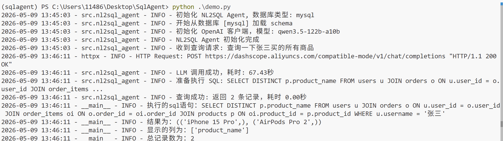

# SqlAgent - Natural Language to SQL Intelligent Query System


## 📖 Project Overview

**SqlAgent** is an intelligent natural language to SQL system based on Large Language Models (LLM), designed to lower the barrier for database queries. It allows non-technical users to easily query databases using everyday language. Simply input a natural language question, and the system will automatically convert it into accurate SQL queries and return results.

### ✨ Core Features

- 🎯 **Natural Language to SQL**: Automatically convert user questions into correct SQL queries
- 🔒 **Secure & Reliable**: Only SELECT queries allowed, with multiple built-in SQL security validation mechanisms
- 🗄️ **Multi-database Support**: (Currently only supports MySQL database)
- 🔄 **Automatic Schema Loading**: Automatically load table structures and relationship information from database metadata
- 💬 **Context-Aware**: Generate precise SQL queries based on complete database Schema
- ⚡ **High-Performance Connection Pool**: Uses DBUtils connection pool management to improve concurrency performance
- 📊 **Result Explanation**: Structured query result returns for easy subsequent processing
- 🛠️ **Modular Design**: Easy to extend with new database types or LLM providers


## 🚀 Quick Start

### Requirements

- Python 3.10+
- OpenAI-compatible LLM API (such as OpenAI, Tongyi Qianwen, DeepSeek, etc.)

### Installation Steps

1. **Clone the repository**
```bash
git clone https://github.com/your-repo/SqlAgent.git
cd SqlAgent
```

2. **Install dependencies**
```bash
pip install -r requirements.txt
```

3. **Configure environment variables**
```
Rename .env.example to .env and fill in your configuration information
```


### Basic Usage

#### Run demo.py

```python
    python demo.py
```

Example output: 

## 📋 Detailed Features

### 1. Automatic Database Schema Loading

The system automatically loads from the database's `INFORMATION_SCHEMA`:
- Table names and table comments
- Column names, data types, primary key information
- Foreign key relationship mappings

Supported database types:
- ✅ MySQL (implemented)
- More databases will be implemented in the future

### 2. SQL Generation Workflow

1. **Schema Formatting**: Convert database structure into LLM-readable text format
2. **Prompt Construction**: Build prompts combining user questions and Schema information
3. **LLM Invocation**: Call large language models to generate SQL statements
4. **SQL Extraction**: Extract valid SQL statements from LLM responses
5. **Security Validation**: Verify SQL legality (SELECT only)
6. **Query Execution**: Execute SQL through connection pool and return results

### 3. Security Mechanisms

- ✅ Only SELECT queries allowed
- ❌ Prohibit dangerous operations like DROP, TRUNCATE, DELETE, UPDATE
- 🔍 SQL syntax validation
- ⏱️ Query timeout control
- 📊 Result set size limits

### 4. Connection Pool Configuration

The system uses `DBUtils.PooledDB` to implement database connection pooling:

```python
PooledDB(
    creator=pymysql,
    maxconnections=10,   # Maximum number of connections
    mincached=2,         # Initial number of idle connections
    maxcached=5,         # Maximum number of idle connections
    maxusage=100,        # Maximum usage count per connection
    ping=1,              # Check connection status before use
    blocking=True,       # Block and wait when connections are full
    reset_session=True   # Reset session when returning connection
)
```

## 📁 Project Structure

```
SqlAgent/
├── src/                          # Source code directory
│   ├── __init__.py               # Module initialization
│   ├── nl2sql_agent.py           # Core Agent class
│   ├── schema.py                 # Schema data model
│   ├── schema_loader.py          # Schema loader
│   └── prompts/                  # Prompt template directory
│       └── mysql.txt             # MySQL-specific prompt
├── logs/                         # Log directory
├── requirements.txt              # Python dependencies
└── README.md                     # Project documentation
```


## 🛡️ Important Notes

1. **API Key Security**: Do not hardcode API keys in the code. Use environment variables or configuration files instead
2. **Database Permissions**: Ensure the database user has permissions to read `INFORMATION_SCHEMA` and execute SELECT statements
3. **LLM Selection**: Recommended to use models with strong Chinese understanding capabilities (such as Tongyi Qianwen, GPT-4, etc.)
4. **Schema Updates**: When database structure changes, reinitialize the Agent to load the latest Schema
5. **Query Complexity**: Overly complex natural language questions may affect SQL generation accuracy. Optimize questioning methods when necessary

## Future Development
This project will support more vendors in the future.

## 🤝 Contributing

Issues and Pull Requests are welcome!

## 📄 License

This project is licensed under the MIT License

## 🙏 Acknowledgments

- [OpenAI](https://openai.com/) - Providing powerful LLM capabilities
- [DBUtils](https://webwareforpython.github.io/DBUtils/) - Database connection pool management
- [PyMySQL](https://github.com/PyMySQL/PyMySQL) - MySQL database driver
- [Pydantic](https://docs.pydantic.dev/) - Data validation and serialization


## 📧 Contact

For questions or suggestions, please contact via:
- Submit an Issue
- Send email to: 1148656615@qq.com

---

⭐ If this project helps you, please give it a Star to show your support!
